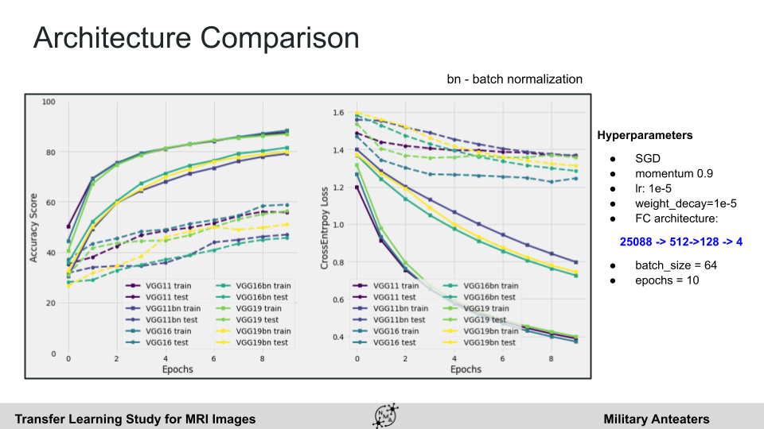

# Transfer Learning for MRI Images Classification

This repository introduces a short project made during my stay at [Neuromatch Summer School 2021](https://academy.neuromatch.io/home).

This summer school was a three‐week intensive training program based on theoretical DL modeling and computational techniques, culminating in a Deep Learning project. In my case, transfer learning project for MRI Tumor Classification using PyTorch and Kaggle Dataset.

It was a project with learning purposes, not a deeper research.

* Final Slides Presentation: [[slides]](https://docs.google.com/presentation/d/1QK7LjetANE6VK_TzhcCo7r8wyTMZz2Ju8AVT8hC8Q6w/edit?usp=sharing)
* Certificate: [[link]](https://drive.google.com/file/d/1M1ObAyUzkG_sR3ga_WqpP10rgSmwSVfR/view?usp=sharing)

## Release

* The dataset was extracted from: https://www.kaggle.com/sartajbhuvaji/brain-tumor-classification-mri
* The based architecture used for transfer learning was [VGG](https://arxiv.org/abs/1409.1556).
    * We tested different architectures extensions: VGG11, VGG16, VGG19, and its respectives batch normalization variants.
* All the programming was performed in the notebook [main_notebook.ipynb](main_notebook.ipynb).